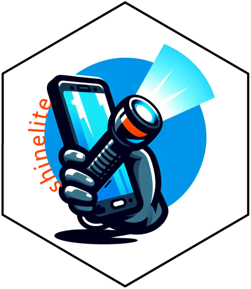
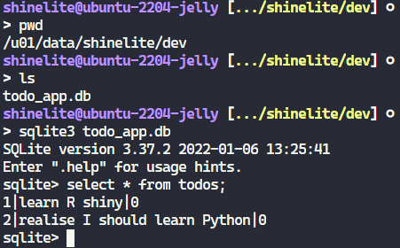

# Shine Lite <a href=""></a>

<!-- badges: start -->

<!-- badges: end -->

A basic lite CRUD application framework for RShiny application development with a SQlite back end.

## Setup

### OS binaries

I started developing this on a vanilla Ubuntu VM and tried to capture all the things needed to get it up and running.

```sh
# Run this from your terminal (not console)
# Install all these OS binaries or you will get caught during the renv restore
sudo apt install build-essential
sudo apt install libcurl4-openssl-dev
sudo apt install libfontconfig1-dev
sudo apt install libharfbuzz-dev libfribidi-dev
sudo apt install libfreetype6-dev libpng-dev libtiff5-dev libjpeg-dev
sudo apt install libxml2-dev
```

### The SQLite DB

Initialise the sqlite db in development environment.

```sh
# Run this from your terminal (not console)
export env=dev
db_path="/u01/data/shinelite/dev/todo_app.db"
sqlite3 $db_path <<EOF
CREATE TABLE IF NOT EXISTS todos (
    id INTEGER PRIMARY KEY,
    todo TEXT,
    done BOOLEAN DEFAULT FALSE
);
EOF
```

### The Renvironment

Create a `.Renviron` file in the root of the cloned repository and populate it with this:

```ini
env=dev
```

Start with the initial install of renv.

```R
install.packages('renv')
```

Now install everything else with a renv restore

```R
renv::restore()
```

We also need the dev tools package to make all functions available.

```R
devtools::load_all(".")
```

## Run the RShiny application in dev mode

```R
runShineLite()
```

Remember to add the two most important things to your new todo list:


## Checking the DB

Just to show how to confirm that the DB was written to using the CLI.



## Adding documentation (optional)

If you want to render out a site for your package you can use package down.

```R
pkgdown::build_site()
```
